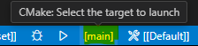

[](https://github.com/sappho192/POCOExercise/actions/workflows/hosted-ninja-vcpkg_submod.yml)
<!-- [](https://github.com/sappho192/POCOExercise/actions/workflows/hosted-pure-workflow.yml) -->

# POCOExercise

- [POCOExercise](#pocoexercise)
- [1. Description](#1-description)
- [2. Example list](#2-example-list)
- [3. Setup Guide](#3-setup-guide)
  - [3.1 Windows-specific setup guide](#31-windows-specific-setup-guide)
    - [3.1.1 Install Build Tools for Visual Studio 2022](#311-install-build-tools-for-visual-studio-2022)
    - [3.1.2 Open VSCode from Developer terminal for Visual Studio](#312-open-vscode-from-developer-terminal-for-visual-studio)
  - [3.2 Setting up VSCode Extensions](#32-setting-up-vscode-extensions)
- [4. Build, Debug, and Test](#4-build-debug-and-test)
  - [4.1 How to build](#41-how-to-build)
  - [4.2 How to debug](#42-how-to-debug)
  - [4.3 How to run test](#43-how-to-run-test)
- [5. Integrated Development Environment (IDE) Support](#5-integrated-development-environment-ide-support)
- [6. License](#6-license)

# 1. Description

This repository contains a `C++` based project which have some example code of POCO.

Supports `Linux`/`macOS`/`Windows` on `x64` and `arm64` platforms.

# 2. Example list

- Example 1: Simple TCP Server/Client
- (WIP) Example 2: WebSocket Server/Client

# 3. Setup Guide

## 3.1 Windows-specific setup guide

If you are developing in Linux or macOS, skip to [Section 3.2](#52-setting-up-vscode-extensions).

### 3.1.1 Install Build Tools for Visual Studio 2022

If you have already installed Visual Studio 2022, you can skip this part.

- Go to https://visualstudio.microsoft.com/downloads/
- In `All Downloads`, open up `Tools for Visual Studio` and download `Build Tools for Visual Studio 2022`
- Install the downloaded file

### 3.1.2 Open VSCode from Developer terminal for Visual Studio

- Execute `Developer PowerShell for Visual Studio 2022`
- Go to the project directory (For example, run `cd "C:/REPO/POCOExercise"`)
- Run `vscode .`

Now you can build and run the project! Keep in mind you should always open the project like this way.

(If you clone this repository and open with plain VSCode, you will see following error after all:

```
[cmake] CMake Error: CMake was unable to find a build program corresponding to "Ninja Multi-Config".  CMAKE_MAKE_PROGRAM is not set.  You probably need to select a different build tool.
[cmake] CMake Error: CMAKE_C_COMPILER not set, after EnableLanguage
[cmake] CMake Error: CMAKE_CXX_COMPILER not set, after EnableLanguage
```

## 3.2 Setting up VSCode Extensions

Go to extensions tab and install following extensions:

- C/C++
- C/C++ Extension Pack
- CMake
- CMake Langugage Support
- CMake Tools

After you install the above extensions and select in the status bar the CMake preset (e.g. `ninja-multi-vcpkg`), as show in the following image:


# 4. Build, Debug, and Test

Before build or debug, click the following button to choose the target:



Then choose the target:


## 4.1 How to build

- Open the command palette(`ctrl+shift+p`)
- Run `CMake: Build` to build all targets
- Run `CMake: Build target` to build the target currently selected

## 4.2 How to debug

- Open the command palette(`ctrl+shift+p`)
- Run `CMake: Debug`

## 4.3 How to run test

- Open the command palette(`ctrl+shift+p`)
- Run `CMake: Run Tests`

# 5. Integrated Development Environment (IDE) Support

The major `C++` IDEs should already support `CMakePresets.json` and require no particular configuration.

For example [Visual Studio Code](https://code.visualstudio.com/) with the [CMake Tools extension](https://marketplace.visualstudio.com/items?itemName=ms-vscode.cmake-tools) let you to open the root folder of this repository, and select in the status bar the CMake preset (e.g. `ninja-multi-vcpkg`), as show in the following image:


# 6. License

All the content in this repository is licensed under the [MIT License](LICENSE.txt).

Copyright © 2024 Luca Cappa, Taein Kim
